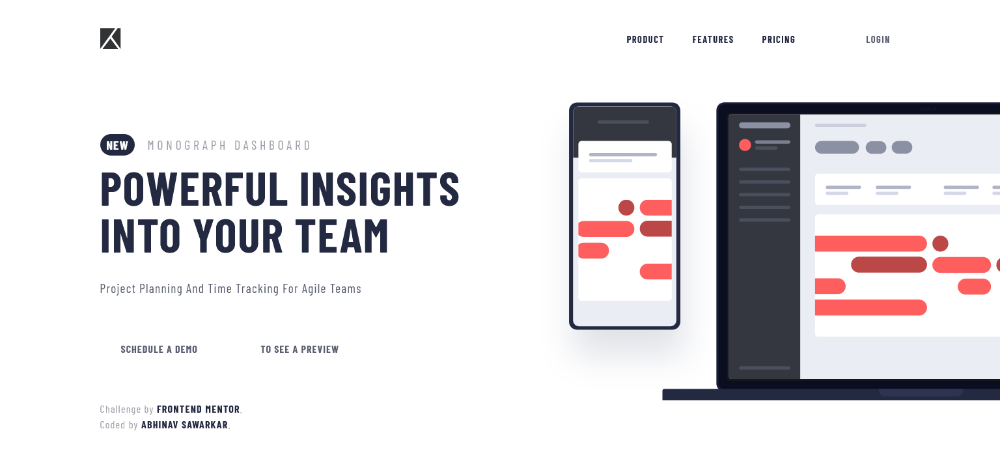

# Frontend Mentor - Project tracking intro component solution

This is a solution to the [Project tracking intro component challenge on Frontend Mentor](https://www.frontendmentor.io/challenges/project-tracking-intro-component-5d289097500fcb331a67d80e). Frontend Mentor challenges help you improve your coding skills by building realistic projects. 

## Table of contents

- [Overview](#overview)
  - [The challenge](#the-challenge)
  - [Screenshot](#screenshot)
- [My process](#my-process)
  - [Built with](#built-with)
  - [What I learned](#what-i-learned)
  - [Continued development](#continued-development)
- [Author](#author)


## Overview

### The challenge

Users should be able to:

- View the optimal layout for the site depending on their device's screen size
- See hover states for all interactive elements on the page

### Screenshot




## My process
- Structued the layout followig a mobile-first approach
- styled using Sass , a CSS Preprocessor.
### Built with

- Semantic HTML5 markup
- CSS custom properties
- Flexbox
- CSS Grid
- Mobile-first workflow

### What I learned

```html
<h1>Some HTML code I'm proud of</h1>
```
```css
.written-in-scss {
  color: var(--usingvariable);
}
```

### Continued development
- Focusing On CSS Layouts
- Looking into advanced CSS transforms like transform3d


## Author
- Frontend Mentor - [@abhinavishere](https://www.frontendmentor.io/profile/abhinavishere)
- Twitter - [@probablyabhinav](https://www.twitter.com/probalyabhinav)


